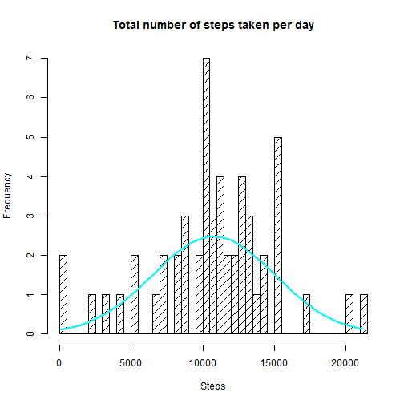
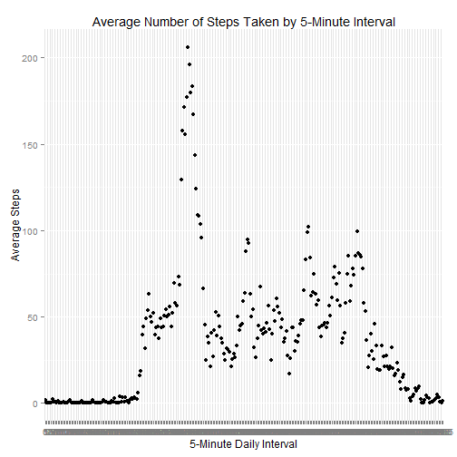
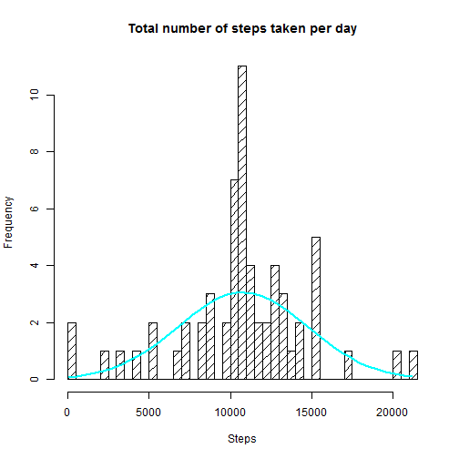

<br/>
<br/>

## Loading and preprocessing the data

First I download the file from the url

```r
url<-"https://d396qusza40orc.cloudfront.net/repdata%2Fdata%2Factivity.zip"
download.file(url,destfile="activity.zip", method="curl")
```

```
## Warning: running command 'curl  "https://d396qusza40orc.cloudfront.net/repdata%2Fdata%2Factivity.zip"  -o "activity.zip"' had status 127
## Warning: download had nonzero exit status
```
Then I proceed to unzip, read the data and get the date format


```r
file<-unzip("activity.zip")
data<-read.csv("activity.csv")
data$date <- as.Date(data$date, "%Y-%m-%d")
```

And make use of **head** to see what does it look like

```r
head(data)
```

```
##   steps       date interval
## 1    NA 2012-10-01        0
## 2    NA 2012-10-01        5
## 3    NA 2012-10-01       10
## 4    NA 2012-10-01       15
## 5    NA 2012-10-01       20
## 6    NA 2012-10-01       25
```

<br/>

## What is mean total number of steps taken per day?

I make use of **aggregate** which allows me to split the data into subsets and compute summary statistics for each


```r
dailysteps = aggregate(steps ~ date, data = data, sum)
head(dailysteps)
```

```
##         date steps
## 1 2012-10-02   126
## 2 2012-10-03 11352
## 3 2012-10-04 12116
## 4 2012-10-05 13294
## 5 2012-10-06 15420
## 6 2012-10-07 11015
```

And with that I'm ready to do a histogram of the steps

```r
x<-dailysteps$steps
h<-hist(x, breaks=50, density=10, xlab="Steps", main="Total number of steps taken per day") 
           
xfit<-seq(min(x),max(x),length=40) 
yfit<-dnorm(xfit,mean=mean(x),sd=sd(x))
yfit <- yfit*diff(h$mids[1:2])*length(x)
lines(xfit, yfit, col="cyan", lwd=2)
```

 

By now, calculating the mean and median steps taken per day is straightforward

```r
meanSteps <- mean(dailysteps$steps, na.rm = TRUE)
medianSteps <- median(dailysteps$steps, na.rm = TRUE)
```
The mean number of steps taken per day is *10766.19* and the median number of steps take per day is *10765*.

<br/>

## What is the average daily activity pattern?

To make a time series plot of the 5-minute interval and the average number of steps taken (averaged across all days), again I make use of **aggregate** (as explained above) and just plot it with qplot


```r
library(ggplot2)
avgSteps <- data.frame(xtabs(steps ~ interval, aggregate(steps ~ interval, data, mean)))

qplot(interval, Freq, data = avgSteps, ylab = "Average Steps", xlab = "5-Minute Daily Interval") + labs(title = "Average Number of Steps Taken by 5-Minute Interval")
```

 

Now that we have the average across all the days in the dataset, getting the interval which has the maximum number of steps is straightforward

```r
maxInterval <- which.max(avgSteps$Freq)
maxSteps <- max(avgSteps$Freq)
```
Interval *104* contains the maximum number of steps on average of *206.17*.

<br/>

## Imputing missing values

To calculate the total number of missing values, I get the length of total records, the length of total complete records and substract them to get the total missing records

```r
totalRecords <- length(data$steps)
completeRecords <- length(na.omit(data$steps))
missingRecords <- totalRecords - completeRecords
```
Total Records: *17568*

Complete Records: *15264*

Missing Records: *2304*

<br/>

For filling in all of the missing values in the dataset I replace missing step values with the mean for a given 5-minute interval across the entire observation period


```r
data$steps2 <- data$steps

for (i in 1:length(data$steps)) if (is.na(data$steps[i])) {
    data$steps2[i] = mean(data$steps, na.rm = TRUE)
}
```

And now I create a new dataset that is equal to the original dataset but with the missing data filled in, with the intention to make a histogram of the total number of steps taken each day and calculate and report the mean and median total number of steps taken per day.


```r
######################################
###### WITH MISSING DATA FILLED ######
######################################

##Create new dataset
dataNew <- data.frame(steps = data$steps2, date = data$date, interval = data$interval)
dailystepsNew <- aggregate(steps ~ date, data = dataNew, sum)

## Histogram
x<-dailystepsNew$steps
h<-hist(x, breaks=50, density=10, xlab="Steps", main="Total number of steps taken per day") 
           
xfit<-seq(min(x),max(x),length=40) 
yfit<-dnorm(xfit,mean=mean(x),sd=sd(x))
yfit <- yfit*diff(h$mids[1:2])*length(x)
lines(xfit, yfit, col="cyan", lwd=2)
```

 

```r
##Calculate mean and median
mean(dailystepsNew$steps, na.rm = TRUE)
```

```
## [1] 10766
```

```r
median(dailystepsNew$steps, na.rm = TRUE)
```

```
## [1] 10766
```

We get the values *10766* & *10766* and we can see that they are almost equal to the estimates from the first part. Imputing missing data on the estimates of the total daily number of steps has low impact.

<br/>

## Are there differences in activity patterns between weekdays and weekends?

As suggested, for this part I make use of the **weekdays** function and the dataset with the filled-in missing values to create a new factor variable in the dataset with two levels - "weekday" and "weekend" indicating whether a given date is a weekday or weekend day.

Since I get the date from Spain, using weekdays will return the days in Spanish language, that's why I need to write *sabado* & *domingo* instead of *saturday* & *sunday* (even though I have my operative system in English).


```r
day <- weekdays(dataNew$date)
dayType <- vector()
for (item in day) {
    if (item == "sabado" || item == "domingo") {
        dayType <- append(dayType, "weekend")
    } else {
        dayType <- append(dayType, "weekday")
    }
}
dataNew$dayType <- factor(dayType)
```

And finally we are ready to make a panel plot containing a time series plot of the 5-minute interval and the average number of steps taken, averaged across all weekday days or weekend days. 


```r
avgStepsNew <- data.frame(xtabs(steps ~ interval + dayType, aggregate(steps ~ interval + dayType, dataNew, mean)))
qplot(interval, Freq, data = avgStepsNew, facets = dayType ~ .)
```

 
